# 🎨 Ethereal Canvas - Flowcharts & System Diagrams

This document contains comprehensive flowcharts visualizing the architecture, user flows, and processes of the Ethereal Canvas platform.

---

## 📊 Table of Contents
1. [Overall User Journey](#overall-user-journey)
2. [AI Image Generation Flow](#ai-image-generation-flow)
3. [NFT Minting Process Flow](#nft-minting-process-flow)
4. [System Architecture Flow](#system-architecture-flow)
5. [Application Navigation Flow](#application-navigation-flow)
6. [Wallet Connection Flow](#wallet-connection-flow)
7. [Error Handling & Failover Flow](#error-handling--failover-flow)

---

## 🚀 Overall User Journey

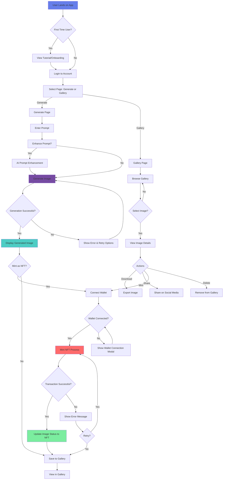

---

## 🤖 AI Image Generation Flow

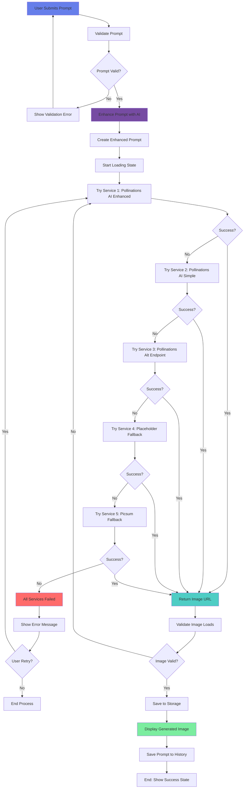

---

## ⛓️ NFT Minting Process Flow

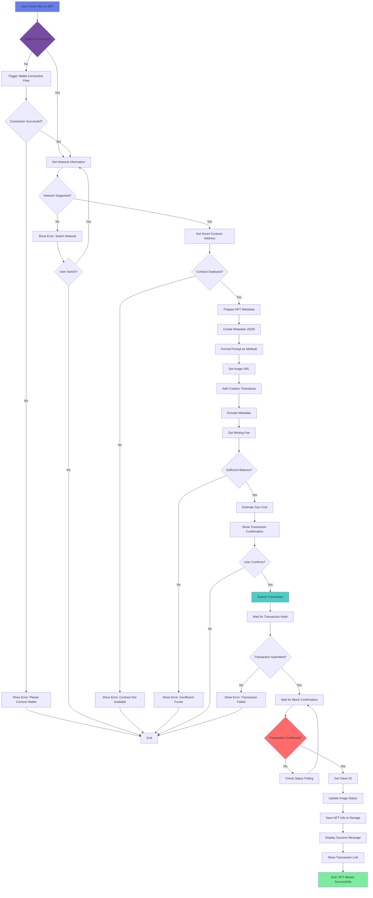

---

## 🏗️ System Architecture Flow

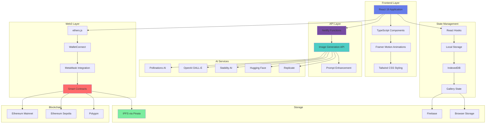

---

## 📱 Application Navigation Flow

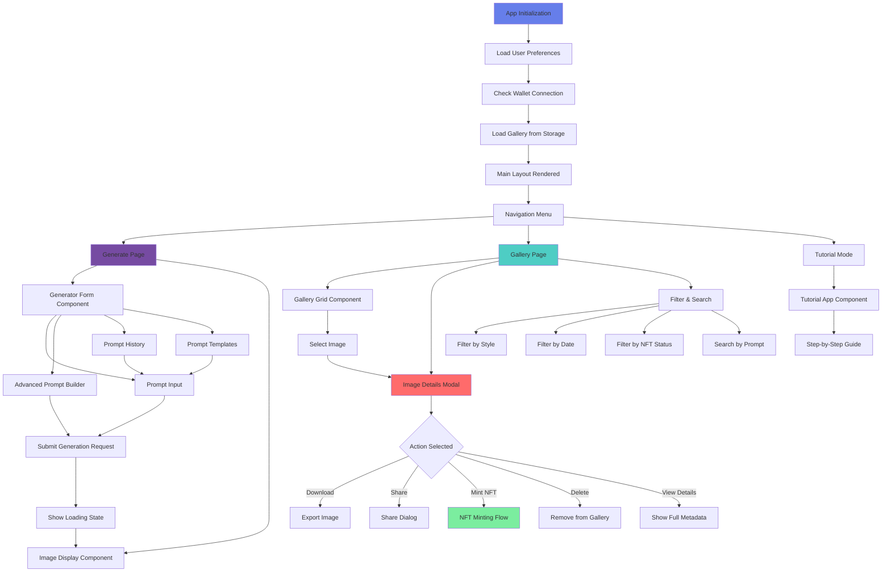

---

## 💼 Wallet Connection Flow

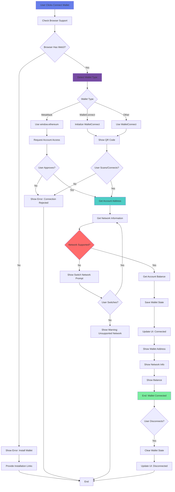

---

## 🔄 Error Handling & Failover Flow

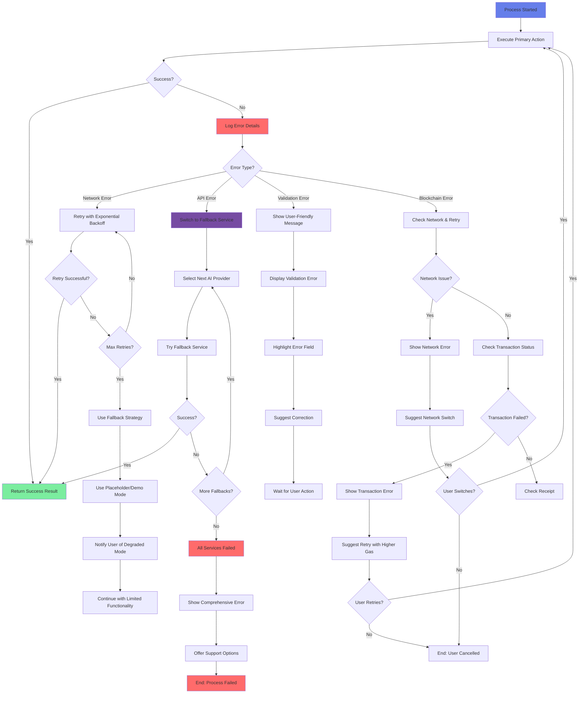

---

## 📊 Data Flow Diagram

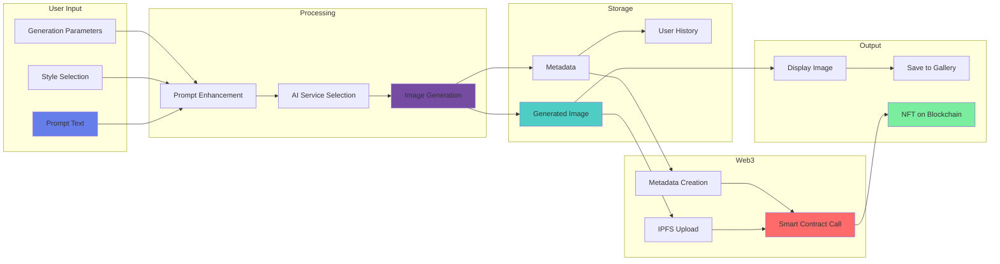

---

## 🔐 Authentication & Permission Flow

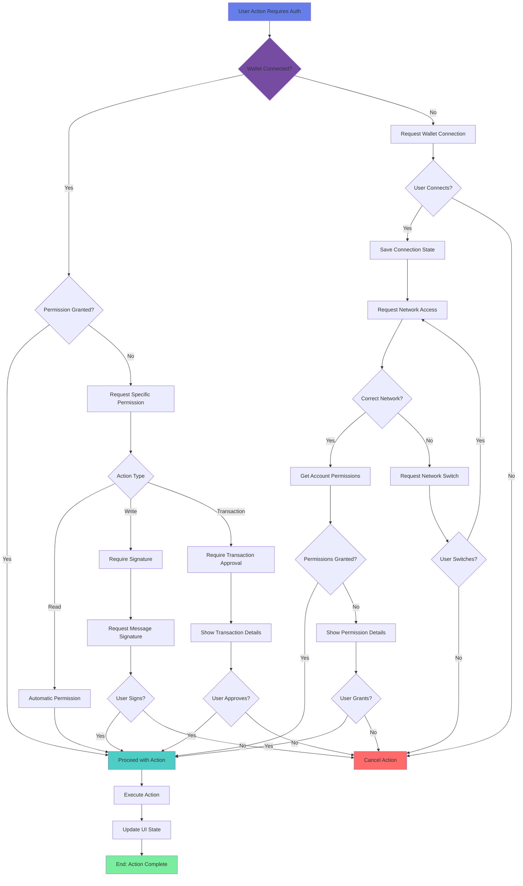

---

## 🎨 Prompt Enhancement Flow

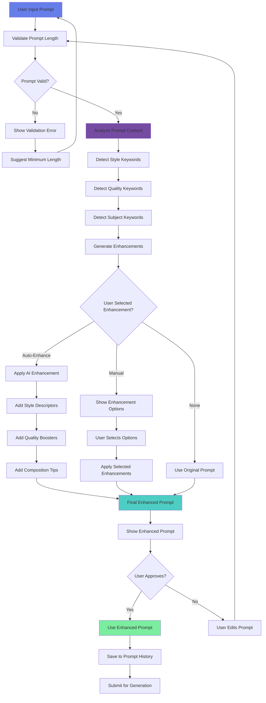

---

## 📈 Gallery Management Flow

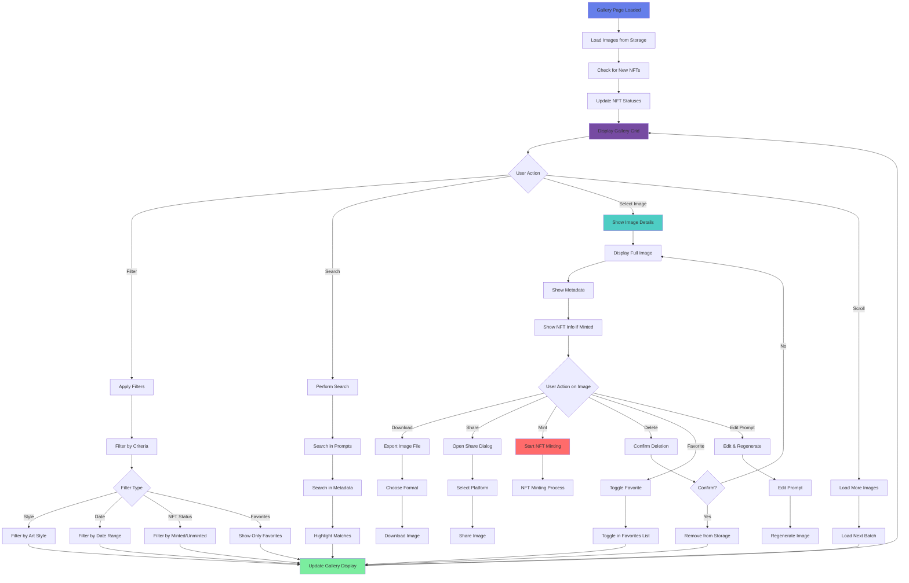

---

## 🛠️ How to Use These Flowcharts

### For Markdown Viewers (GitHub, VS Code with Mermaid extension)
These flowcharts use Mermaid syntax and will render automatically in:
- GitHub (when viewing .md files)
- VS Code (with Mermaid extension)
- Most modern markdown viewers

### For Presentations
1. **Copy the Mermaid code** for the flowchart you need
2. **Use online tools:**
   - [Mermaid Live Editor](https://mermaid.live/)
   - Export as PNG/SVG
3. **Embed in PowerPoint/Keynote:**
   - Export as image
   - Insert into slides

### For Documentation
- Use these flowcharts in technical documentation
- Reference specific flows in code comments
- Include in API documentation

---

## 📝 Notes

- **Colors**: Each flowchart uses a consistent color scheme:
  - Blue (#667eea): Starting points
  - Purple (#764ba2): Processing steps
  - Cyan (#4ecdc4): Success states
  - Red (#ff6b6b): Error conditions
  - Green (#7bed9f): Final success/completion

- **Decision Points**: All diamond shapes represent decision points requiring user input or system checks

- **Sub-processes**: Some flows reference other flowcharts (e.g., NFT Minting Flow references Wallet Connection)

---

**Last Updated**: 2025

